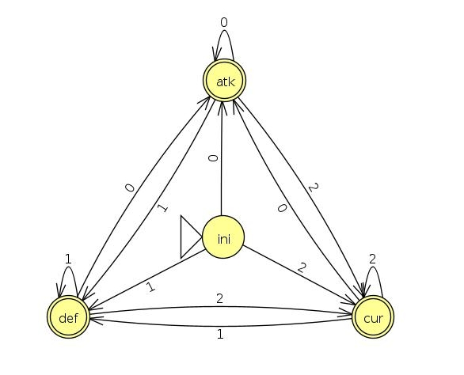
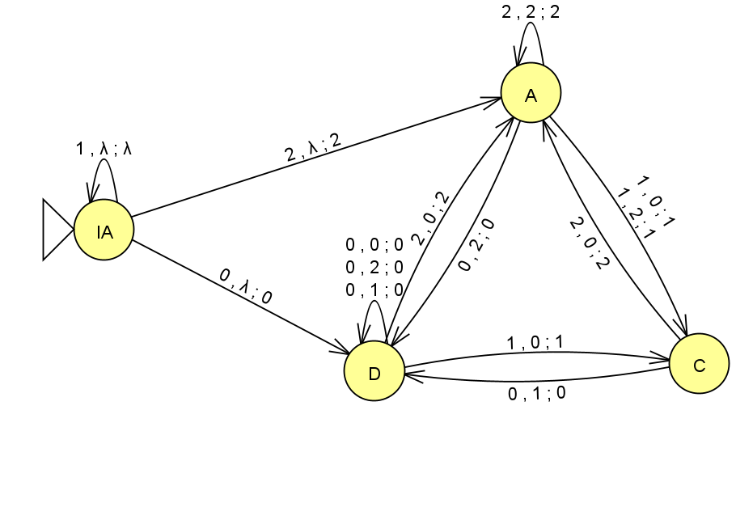

<div class="titlepage">

<div class="center">

**Universidade Federal de Viçosa - Campus Florestal**  
Fundamentos da Teoria da Computação  
**Trabalho Prático Final**  
João Francisco Hecksher Olivetti **3893**  
Maurício Masaharu Okuyama **4239**  
Marcus Vinicius Guerra Ribeiro **4240**  
João Pedro Rafael Santos Silva **3899**  
Renan Grassi de Freitas Procópio **3987**  
joao.olivetti@ufv.br, mauricio.okuyama@ufv.br, joao.p.rafael@ufv.br,
marcus.guerra@ufv.br, renan.procopio@ufv.br  

</div>

</div>

# Introdução

O objetivo deste trabalho é implementar Máquinas de Estado para o duelo
entre Zaun e Piltover em um mundo fictício, onde cada uma das transições
dessas máquinas representa uma ação de atacar, defender ou curar durante
o duelo.

# Desenvolvimento

A linguagem Python foi escolhida pela facilidade de escrita de códigos,
característica dessa linguagem.

## Máquina de Moore

#### 

A Máquina de Moore foi implementada como a classe MaquinaMoore, que
possui os seguintes atributos: estado inicial, estado atual e uma lista
de instâncias da classe Estado. A classe Estado é composta por um nome,
uma saída (ataque, defesa, cura, vazio) e um dict de transições. Em
Python, um dict é uma coleção de pares chave-valor, onde a chave
representa a entrada e o valor representa o estado de destino. Um método
importante da MaquinaMoore é o faz_transicao, que realiza uma transição
de acordo com a entrada passada como parâmetro. Segue abaixo as
definições relevantes dessas classes:

``` python
class Estado:
    def __init__(self, nome, saida, transicoes_dict):
        self.nome = nome
        self.saida = saida
        self.transicoes_dict = transicoes_dict
        
class MaquinaMoore:
    def __init__(self, estados, estados_inicial, transicoes):
        self._nome_estado_inicial = estados_inicial
        self._lista_estados = self._parse_estados(estados, transicoes)
        self._nome_estado_atual = self._nome_estado_inicial
    
    def faz_transicao(self, entrada):
        estado = self._find_estado_atual()
        nome_estado_dest = estado.transicoes_dict[entrada]
        self._nome_estado_atual = nome_estado_dest
        return self.get_saida_atual()
```

#### 

Para determinar a saída de um estado, foi utilizado um iterador
circular, que ditrisbui de maneira circular as saídas (ataque, defesa e
cura), como no trecho abaixo:

``` python
saidas = (Saida.ATAQUE, Saida.DEFESA, Saida.CURA)
# iterador circular, sempre que chamar next(cycler) vai ir pro proximo valor de saidas
# se acabar os valores comeca do comeco de novo(por isso é circular)
cycler = itertools.cycle(saidas)
```

## Autômatos Finitos Determinísticos e Não Determinísticos

A classe FiniteStateAutomata possiblita a representação e a utilização
tanto de AFDs quanto AFNs, mudando de acordo com as transições definidas
na máquina. Ela pode ser utilizada tanto para o combate requerido na
especificação quanto para simular uma máquina isolada, e devido a esta
necessidade existem funções cujos nomes parecem redundantes:
basicamente, as funções em português são as utilizadas no projeto,
exceto pela função readfile. Essa classe possui um método inicializador
que configura o autômato. Ela recebe um parâmetro hardcoded que, se
definido como True, deixa o autômato para ser definido através de
arquivo de texto, que ocorre nos casos de execução do combate. Caso
contrário, ele solicita ao usuário a entrada para definir os estados,
estado inicial, estados finais e transições.

\-**faz_transicao**: O método realiza uma transição no autômato, mudando
seu current_state interno. Ele recebe uma letra de entrada, busca por
uma transição correspondente e atualiza o estado atual de acordo.

\-**get_saida_atual**: Necessário para o mecanismo de combate, mapeia o
último valor de input que levou a uma transição de sucesso para um valor
de enumeração do enum da classe Saida. Ele retorna o valor de enumeração
correspondente, representando a saída do autômato.

\-**read_file**: lê um arquivo de texto contendo os estados, estado
inicial, estados finais e transições do autômato. Ele analisa as linhas
do arquivo para extrair as informações necessárias e atualiza o autômato
de acordo.

**O Autômato Utilizado no combate:**



Essa máquina funciona de forma que, a partir de qualquer estado, uma
entrada X só possa levar a um mesmo estado. Dessa forma, há um laço
entre o estado e a entrada, sendo possível nomear um estado de acordo
com a transição que leva até ele.

## Automato de pilha

#### 

A Clase AutomatoDePilha abstrai um Automato de Pilha(AP), utilizando um
vetor de caracteres para representar a pilha, e os métodos internos da
pilha. Na inicialização do AP são passados os estados e transições, e
utiliza o método interno "\_parse_estados". O método passa pelos estados
e transições lidos do arquivo de entrada e retornado pelo método de
leitura do AP. Utilizando outras duas classes "Estado" e "Transicao",
para auxílio da verificação de qual transição pode ser realizada de
acordo com a entrada e o caractere no topo da pilha.

``` python
def _parse_estados(self, estados, transicoes):
    # Cria os estados e suas transicoes
    _estados = []
    saidas = [Saida.DEFESA,  Saida.CURA, Saida.ATAQUE]
    for estado in estados:
        transicoes_dict = []
        for transicao in transicoes:
            if estado.strip() == transicao[0].strip():
                _transicao = Transicao(
                    transicao[1][0], transicao[1][1], transicao[1][2], transicao[1][3])
                transicoes_dict.append(_transicao)

        _estado = Estado(estado, transicoes_dict, Saida.VAZIO if estado == self._nome_estado_inicial else saidas[int(transicao[1][0])])
        _estados.append(_estado)
    return _estados
```

### O automato utilizado no combate:

**O Automato de Pilha Utilizado no combate:**



### Realizando a transição no Automato de Pilha

#### 

Para realizar a transição existem dois cenários, com a pilha vazia e com
a pilha cheia, ele verifica transição saindo do estado atual, e verifica
qual a primeira que satisfaz o critério do símbolo a ser lido e do
símbolo no topo da pilha, caso os dois requisitos sejam satisfeitos o
novo estado atual passa a ser o estado de destino daquele estado, e
retorna a saída do novo estado.

``` python
def faz_transicao(self, entrada):
    # Realiza transicao da maquina
    estado = self._find_estado_atual()
    for transicao in estado.transicoes:
        if not self.pilha_vazia():
            if transicao.simbolo_a_ser_lido == entrada and transicao.simbolo_a_desempilhar == self._pilha[-1]:
                self._nome_estado_atual = transicao.estado_destino
                self._estado_atual = self._find_estado_atual()
                des = self.desempilha()
                if transicao.simbolo_a_empilhar != '*':
                    self.empilha(transicao.simbolo_a_empilhar)
                return self.get_saida_atual()
        else:
            if transicao.simbolo_a_ser_lido == entrada and transicao.simbolo_a_desempilhar == '*':
                self._nome_estado_atual = transicao.estado_destino
                self._estado_atual = self._find_estado_atual()
                if transicao.simbolo_a_empilhar != '*':
                    self.empilha(transicao.simbolo_a_empilhar)
                return self.get_saida_atual()
```

#### 

Ao finalizar a transição, o simbolo de empilhamento está na última
posição do vetor, o novo estado está na variável "\_estado_atual" e a
saída definida no estado é retornada para o combate. As próximas
transições realizadas levarão em consideração as transições contidas no
estado em questão.

## Combate

#### 

A classe "Combate" representa um combate entre dois jogadores. O método
"executa" inicia o combate, alternando os turnos entre os jogadores.
Durante cada turno, os jogadores realizam ações com base nas transições
das máquinas de estado. As ações incluem atacar e curar, dependendo das
saídas das máquinas de estado. O combate continua até que um jogador
tenha sua vida reduzida a zero, momento em que o vencedor é declarado
com base na vida restante.

``` python
class Combate:
    def __init__(self, player1, player2):
        self.player1 = player1
        self.player2 = player2
        self.turno = 0

    def executa(self):
        clear()

        # escolhe quem tem prioridade aleatoriamente
        player1 = random.choice([self.player1, self.player2])
        player2 = self.player1 if player1 == self.player2 else self.player2
```

# Utilização

Devido a não utilização de bibliotecas externas, não é necessária a
instalação de nenhum dependência. A execução do código se dá pelo
comando "python3 main.py". Ao executá-lo, um menu é apresentado com as
opções de batalha.
